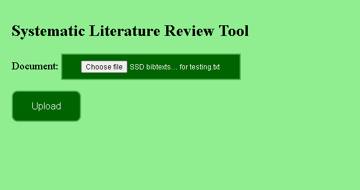
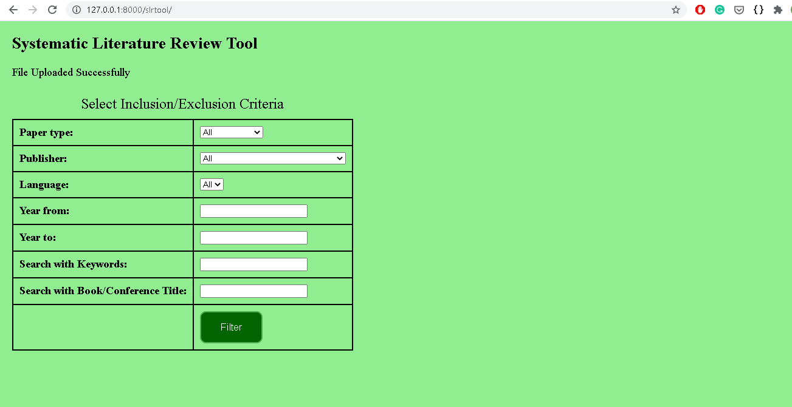
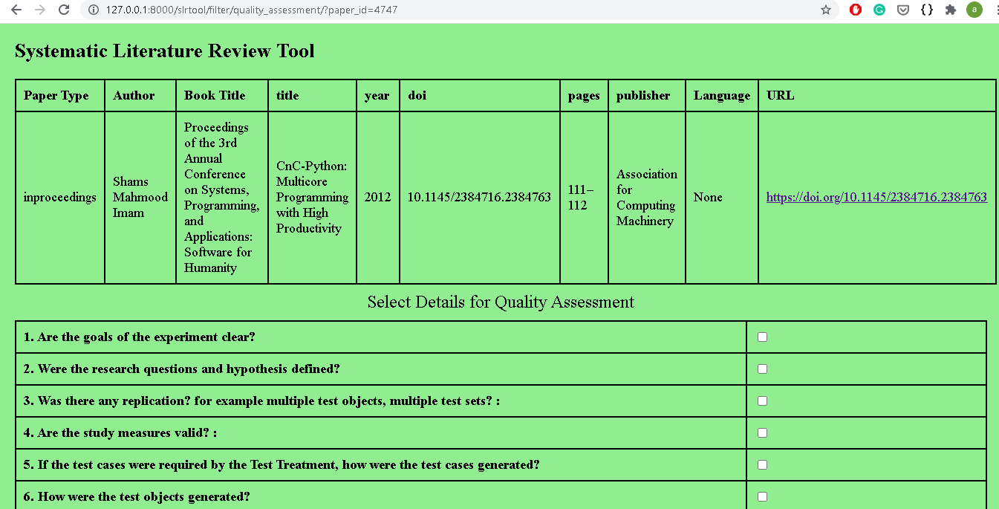
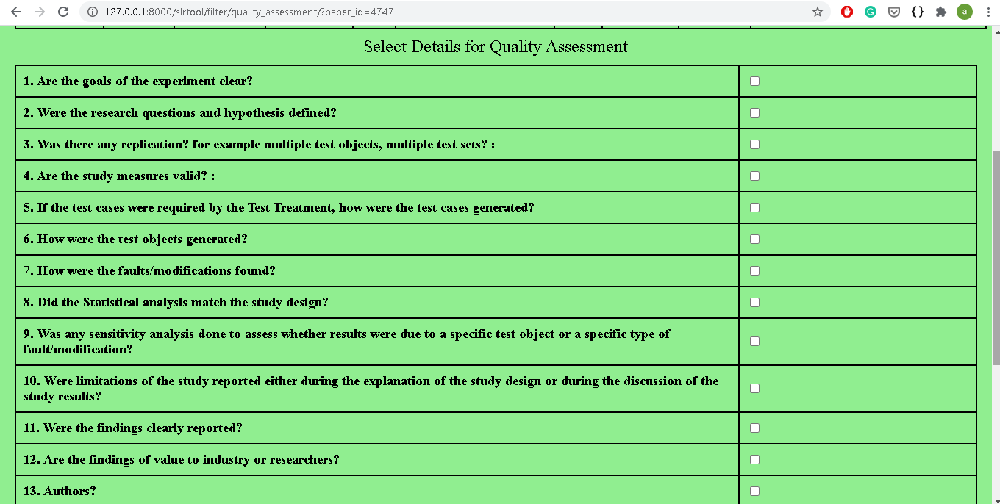

# SLR_Tool-Data_Storage_and_Interface_for_Preprocessing
Aim of the project is to develop a Systematic Literature Review(SLR) Tool for data storage and preprocessing of research papers from various digital libraries like ACM digital library, IEEE Xplore, etc. Based on some inclusion/exclusion criteria, research papers have to be filtered and then the quality assessment should be done and present the resultant research papers.
Input will be provided in a Bibtex file containing metadata of research papers. Output will be filtered research papers fetched from various libraries.

## Developers
1. Aviral Sharma 
2. Arpit Maheshwari 
3. Ankit Parashar

## Mentors
1. Sai Raju Ram Chander Chikkala
2. V D Shanmukha Mitra
3. Abhishek Mathur

## Approach
The following steps are performed :
1. The list of papers is taken as input in a BibTex file.
2. Read the file using Pybtex and stored data in Database using Python and DBMS concepts.  
3. Then Filtering of Research Papers can be done based on:
    * Inclusion Criteria
    * Exclusion Criteria
    * Quality Assessment
    
    Some Examples of Inclusion and Exclusion Criteria to be considered:
    * Papers which are published from the year 2000 to 2020 are accepted or not.
    * Excluding papers with pages less than or equal to 4.
    * Exclude papers that are not in English.
    * Exclude papers that are not fully accessible.

    Quality assessment:
    User can fill quality assessment form which contains 12 quality check-points for the filtered paper and give remarks for the quality test.

 4. Developed a User interface to display result as the filtered research paper based on the criteria selected by user in step 3.
 5. User can select and would be able to download filtered research papers.

## Technology Stack
* Python
* Django
* SQLite
* HTML, CSS and Javascript
* Pybtex library

## Libraries in consideration :
 1. ACM Digital Library: https://dl.acm.org/
 2. IEEE Xplore: https://ieeexplore.ieee.org/Xplore/home.jsp/
 3. Springer Digital Library: https://link.springer.com/ 
 4. Science Direct: https://www.sciencedirect.com/

## Setup for installing the project
In order to run this project on your machine, external libraries are to be installed using pip.
1. Django - `pip install django`
2. Pybtex - `pip install pybtex`
3. After installing above libraries. Run project by using following command
`python manage.py runserver`

## Relevant study material
1. For Front-end development: https://www.w3schools.com/ 
2. For Python: https://docs.python.org/3/  
3. For Javascript: https://devdocs.io/javascript/ 

## Some screenshots from project 
#### Upload bibtex file page

#### Inclusion/Exclusion Criteria Page with all the Validations. Dynamically values are fetched for papertype, publisher and language from database.

#### Filtered research papers on the basis of Inclusion/exclusion criteria selected

#### Quality Assement Page for selected Paper

## Conclusion and Scope for Improvement
The project is simple ligh weight and good for basic SLR tool processing. 
It includes all the basic requirements like filterring of research papers and Quality Assessment. 
But additional features can be added like report generation for filtered papers with Quality Assessment data. 
Also research papers can be fetched and displayed on the Quality Assessment page. 
Apart from this user interface can be improved with some modern libraries like bootstrap.  

